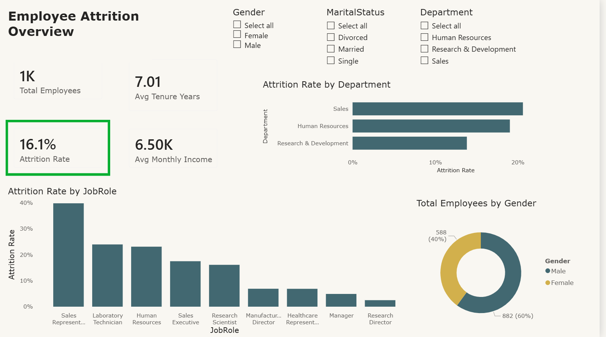
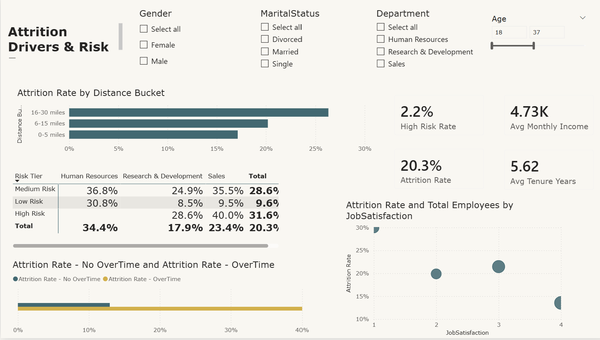
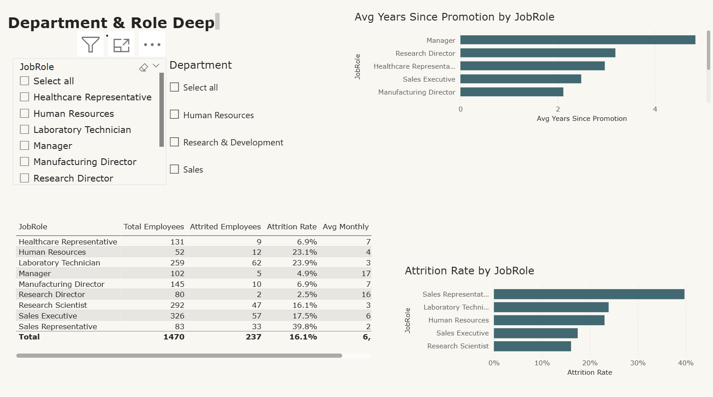

# HR Attrition Analytics Dashboard

A Power BI dashboard analyzing employee attrition patterns to help HR teams identify at-risk employee segments and prioritize retention efforts.

---

## Business Problem

Employee turnover carries significant hidden costs: recruitment, onboarding, lost productivity, and knowledge drain. Most organizations only react to attrition after it happens. This dashboard takes a proactive approach: it segments employees by risk factors (overtime, job satisfaction, work-life balance, commute distance) so HR can identify who is likely to leave before they do, and where to focus retention efforts for the greatest impact.

## Dataset

- **Source:** [IBM HR Analytics Employee Attrition & Performance](https://www.kaggle.com/datasets/pavansubhasht/ibm-hr-analytics-attrition-dataset) (Kaggle)
- **Size:** ~1,470 employee records, 35 attributes
- **Note:** This is a snapshot dataset with no transactional date field, so the dashboard focuses on segmentation and driver analysis rather than time-series trends.

## Tools Used

| Tool | Purpose |
|---|---|
| Power BI Desktop | Data modeling, DAX, report design |
| Power Query (M) | Data cleaning and transformation |
| DAX | Measures, calculated columns |
| Tabular Editor 2 | Bulk measure review and organization |

## Approach

**1. Data Cleaning (Power Query)**
Removed constant, non-discriminating columns (`Over18`, `StandardHours`, `EmployeeCount`), explicitly typed all fields, and engineered a `Distance Bucket` column to group commute distances into readable ranges. Built a separate reference table to decode ordinal satisfaction scales (1–4) into readable labels.

**2. Data Modeling**
Structured around a single `Employees` fact table with a `Risk Tier` calculated column that segments employees into High / Medium / Low risk based on a composite of overtime status, job satisfaction, and work-life balance.

**3. DAX Measures**
Built 10+ measures covering headcount, attrition rate, income and tenure averages, and segmented attrition rate comparisons (e.g., overtime vs. non-overtime), plus a composite High Risk Rate measure.

**4. Dashboard Design**
Three report pages, each answering a different question:

| Page | Purpose |
|---|---|
| **Executive Overview** | What is our overall attrition picture? |
| **Attrition Drivers** | Which factors correlate most strongly with attrition? |
| **Department & Role Deep Dive** | Where specifically is the problem concentrated? |

A drillthrough page (**Employee Detail**) lets users right-click any department to view individual employee-level records filtered to that context.

## Key Insights

- Employees working overtime show a substantially higher attrition rate than those who don't, making overtime the single strongest predictor of attrition in this dataset.
- Employees living 16–30 miles from the office attrite at a noticeably higher rate than those living closer, suggesting commute burden is an underweighted retention factor.
- The Research & Development department carries the highest concentration of high-risk employees, driven by a combination of overtime prevalence and lower job satisfaction scores.
- **Recommendation:** Prioritize retention conversations and workload review for overtime-heavy roles in Research & Development, and consider remote/hybrid flexibility for employees with longer commutes.

## Dashboard Preview

**Author:** Raeha Hanif
